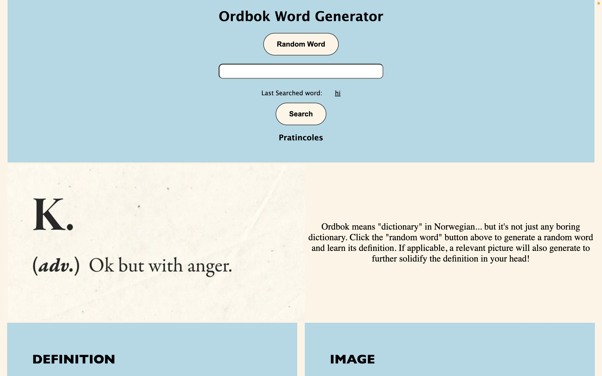

# Ordbok Word Generator Dictionary

## Description
    A wonderful project brought to you by Meghana Vasireddy, Seeha Sangwang, Carlos Smith, and Robert Severson!

    Welcome to Ordbok!

    Ordbok is a web application that utilizes APIs to generate a certain word, find the definition of said word, and also display a relevant GIF (if applicable). Ordbok utilizes 3 APIs in total - the Random Word API by Herokuapp (http://random-word-api.herokuapp.com/home), the Merriam Webster Dictionary API (https://dictionaryapi.com), and the Giphy API (https://developers.giphy.com). After opening the application, the user will have 2 options - the first allows the user to click the "Random Word" button located in the header and be presented with any random word. If the generated word does not have a definition, a message is displayed, prompting the user to try again. If the generated word does have a definition, it is presented in the "Defintion" box. Some words will also display a relevant gif in the adjacent "Image" box. For words that do not have an associated gif, a default gif will be presented along with default text, informing the user that there is no image. The second option to use Ordbok is more personalized; the user can utilize our search bar to search for a particular, non-random word. Additionally, the user's previously searched word will also be stored and displayed below the search bar.

## User Story
 
    AS A student
    I WANT to be able to learn random words and search words with definitions and images to go along with them
    SO THAT I can retain the information better in the future
 
 
## Acceptance Criteria

    GIVEN a dictionary website with search and random inputs
    WHEN I click on Random Word
    THEN I am presented with information on that word
    WHEN I view the definition column
    THEN I am presented with a definition from the Merriam Webster Dictionary API
    WHEN I view the image column
    THEN I am presented with a gif that is relevant to the word
    WHEN I search for a word
    THEN I am given information for the word that I have searched
    WHEN I am presented with the information of the word
    THEN I am given the same definition and image columns as the random word function
    WHEN I click on the search bar again
    THEN I am presented with all of my past searches
    WHEN I click on one of the previously searched word
    THEN I can have the website re-search that term

## Installation
    No installation required.

## Usage
Deployed application:

## License
    N/A